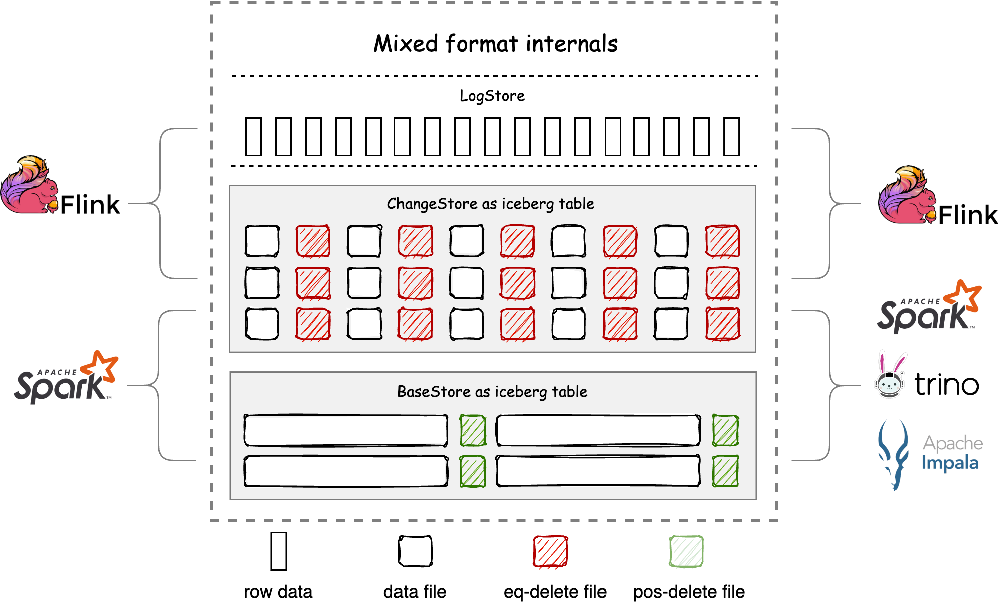
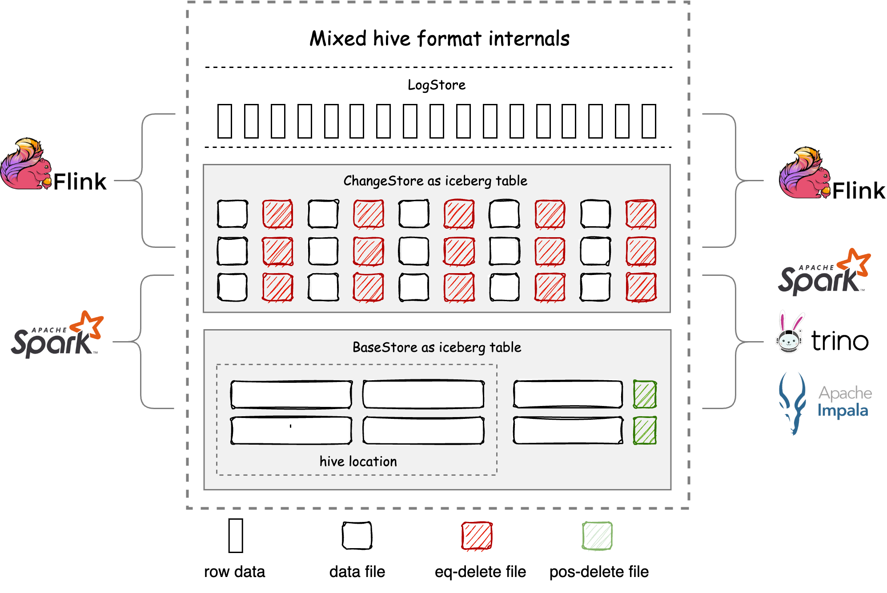

## Introduction

Table format (aka. format)最早由 Iceberg 提出，table format 可以描述为：

- 定义了表和文件的关系，任何引擎都可以根据 table format 查询和检索数据文件
- Iceberg / Delta / Hudi 这类新型 format 进一步定义了表与快照，快照与文件的关系，表上所有写操作会产生新快照，所有表的读操作都面向快照，快照为数据湖带来了 MVCC、ACID 以及 Transaction 的能力。

此外，[Iceberg](https://Iceberg.apache.org/) 这类新型 table format 还提供了 schema evolve、hidden partiton、data skip 等众多高级特性，[Hudi](https://hudi.apache.org/)、[Delta](https://delta.io/) 在具体功能上可能有所差异，但我们看到在过去两年的迭代中，table format 的标准随着三个开源项目的功能趋同在逐步确立。

对用户，Arctic 的设计目标是开箱即用的湖仓系统，而在系统内部，Arctic 的设计理念是将不同 table format 作为数据湖的 storage engine 来使用，这种设计模式多见于 MySQL、ClickHouse 这样的开源系统。Arctic 选择了最早提出 table format 概念的 Iceberg 作为基础，在不魔改社区代码的前提下，为用户提供了一套可以兼容 Hive format，并且在流和更新场景下更加优化的 Mixed format。Iceberg format 和 Mixed format 各有优势，用户可以根据需求灵活选择，并且都能享受到 Arctic 开箱即用的体验。

## Iceberg format

Arctic v0.4 之后开始支持管理原生 Iceberg 表，Iceberg format 具有充分的向上和向下兼容特性，一般情况下，用户不用担心引擎客户端所用的 Iceberg 版本与 Arctic 依赖的 Iceberg 版本的兼容性。

Arctic 同时支持 Iceberg format v1 和 v2，[Iceberg v2](https://iceberg.apache.org/spec/) 中引入了 row-delete 特性，支持 flink 摄取有主键的数据，可以减少更新场景下的写放大：

<left>
{:height="70%" width="70%"}
</left>


???+ 注意 

	与 mixed streaming format 不同，Iceberg format 中的主键只适用于 flink，spark 下不保障主键约束。

## Mixed streaming format

Mixed streaming format 相比 Iceberg format 提供了更多的特性：

- 更强的主键约束，对 Spark 也同样适用
- 通过 auto-bucket 机制，为实时数仓提供生产可用的 OLAP 性能
- 可以通过配置 LogStore，将 data pipeline 的延迟从分钟提升到毫秒/秒
- Hive 或 Iceberg 格式兼容，支持 Hive 秒级原地升级，兼容 Iceberg 各项原生功能
- 事务冲突解决机制，让相同主键的并发写入变得可能

Mixed streaming format 的设计初衷是基于数据湖为大数据平台提供流批一体的存储层，以及离线和实时统一的数据仓库，在这个目标驱动下，Arctic 将 mixed format 设计为三级结构，每级结构命名为不同的 TableStore：

<left>
{:height="80%" width="80%"}
</left>

- BaseStore — 存储表的存量数据，通常由批计算或 optimizing 过程产生，作为 ReadStore 对读更加友好
- ChangeStore — 存储表的流和变更数据，通常由流计算实时写入，也可用于下游的 CDC 消费，作为 WriteStore 对写更加友好
- LogStore — 作为 ChangeStore 的 cache 层来加速流处理，Arctic 会管理 LogStore 和 ChangeStore 的一致性

Mixed format 中 TableStore 的设计理念类似数据库中的聚簇索引，每个 TableStore 可以使用不同 table format。Mixed format 通过 BaseStore 和 ChangeStore 之间的 merge-on-read 来提供高新鲜度的 OLAP，为了提供高性能的 merge-on-read，BaseStore 和 ChangeStore 采用了完全一致的 partition 和 layout，且都支持 auto-bucket。

Auto-bucket 功能帮助 self-optimizing 过程将 BaseStore 的文件大小控制在 target-size 上下，在尽可能维持 base file size 同时，通过 bucket 的分裂和合并来实现数据量的动态伸缩。Auto-bucket 将一个 partition 下的数据按主键哈希的方式分割成一个个主键不相交的集合，极大降低了 optimizing 过程和 merge-on-read 时需要 scan 的数据量，提升了性能，效果请参阅：[benchmark](../benchmark/benchmark.md)

Mixed format 的 auto-bucket 功能参考了论文：[Scalable, Distributed Data Structures for Internet Service Construction](https://people.eecs.berkeley.edu/~culler/papers/dds.pdf)

mixed streaming format 在使用上存在的限制有：

- Compatibility limited — 在 Hive 和 Iceberg 的兼容写的场景下，可能出现主键唯一性破坏或冲突解决失效
- Primary key constraint — 在主键不包含分区键的情况下，如果流数据中没有更新前像，需要使用 normalized 算子或其他方式还原数据前像，才能保障主键唯一
- Engines integrated — 目前支持 Flink 和 Spark 读写，支持 Trino 和 Impala 查询数据

### Mixed Iceberg format

Mixed Iceberg format 的 BaseStore 和 ChangeStore 都使用 Iceberg format，在 schema、types 和 partition 用法上与 Iceberg 保持一致，在具备 Mixed streaming format 功能特性的同时，可以使用原生 Iceberg connector 读写 BaseStore 和 ChangeStore，从而具备 Iceberg format 的所有功能特性，下面以 Spark 为例，介绍如何用 Iceberg connector 操作 Quick demo 创建的 Mixed Iceberg format 表，我们使用下面的命令打开一个 Spark SQL 客户端：

```shell
spark-sql --packages org.apache.Iceberg:Iceberg-spark-runtime-3.2_2.12:0.14.0\
    --conf spark.sql.extensions=org.apache.Iceberg.spark.extensions.IcebergSparkSessionExtensions \
    --conf spark.sql.catalog.local=org.apache.Iceberg.spark.SparkCatalog \
    --conf spark.sql.catalog.local.type=hadoop \
    --conf spark.sql.catalog.local.warehouse=/tmp/Arctic/warehouse
```

之后即可使用如下命令读取、写入这些 Arctic 创建管理的 Iceberg 表：

```shell
-- 切换到 Iceberg catalog 下
use local;

-- 查看所有的 Iceberg 表
show tables;

-- 查看 Basestore
select * from local.test_db.test_table.base;

-- 查看 Changestore
select * from local.test_db.test_table.change;

-- 写入 Basestore
insert into local.test_db.test_table.base value(10, 'tony', timestamp('2022-07-03 12:10:30'));
```

更多 Iceberg 兼容用法可以在 [Iceberg docs](https://Iceberg.apache.org/docs/latest/) 中找到。

???+ 注意 

	Arctic 的 Minor optimizing 功能一般可以保障 Iceberg BaseStore 的数据新鲜度维持在分钟级

### Mixed Hive format

Mixed Hive format 使用 Hive 表作为 BaseStore，Iceberg 表作为 ChangeStore，Mixed Hive format 支持：

- schema、partition、types 与 Hive format 保持一致
- 使用 Hive connector 将 Mixed Hive format 表当成 Hive 表来读写
- 可以将 Hive 表原地升级为 Mixed Hive format 表，升级过程没有数据重写和迁移，秒级响应
- 具有 Mixed streaming format 所有功能特性

Mixed Hive format 结构如下所示：

<left>
{:height="80%" width="80%"}
</left>

在 BaseStore 中，Hive location 下的文件也会被 Iceberg manifest 索引，不会产生两种 format 的数据冗余，Mixed Hive format 融合了 Iceberg 的快照、ACID 以及 MVCC 特性，对 Hive 的使用方式也做出了极大的兼容，为过去围绕 Hive format 搭建的数据平台、流程以及产品提供了灵活的选型和扩展方案。

???+ 注意 

	Hive location 下的数据新鲜度通过 Full optimizing 来保障，因此 Hive 原生读的时效性相比 Mixed Iceberg table 有较大差距，推荐使用 Mixed Hive format 的 Merge-on-read 读取分钟级新鲜度数据

